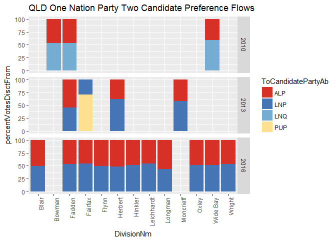

Analysis Process
================
Anthony Contoleon
6 March 2017

Analysing Australian Preference Distribution
============================================

Exploration of the data set
---------------------------

Preference flows at Queensland and National level for the Greens and One Nation.

### QLD Preference Flows

### National Preference Flows

Average ALP share of preferences.
---------------------------------

### Percentage of votes to ALP from GRN

    ## $`2010`
    ##       min       max      mean    median       std 
    ## 43.291098 89.925781 77.323825 78.380055  6.261057 
    ## 
    ## $`2013`
    ##       min       max      mean    median       std 
    ## 42.781999 91.116206 80.888842 81.376721  6.144019 
    ## 
    ## $`2016`
    ##       min       max      mean    median       std 
    ## 28.508772 90.279809 80.117952 80.698577  7.315777

### Percentage of votes to ALP from ON

    ## $`2010`
    ##       min       max      mean    median       std 
    ## 31.081926 71.862069 46.735064 46.705202  9.469148 
    ## 
    ## $`2013`
    ##      min      max     mean   median      std 
    ## 38.02817 63.01946 45.42757 43.94809  7.11410 
    ## 
    ## $`2016`
    ##       min       max      mean    median       std 
    ## 45.064935 63.733150 50.177415 48.548275  5.287676

Average LNP/LP share of preferences.
------------------------------------

### Percentage of votes to LNP/LP from ON

    ## $`2010`
    ##       min       max      mean    median       std 
    ## 28.137931 68.918074 53.353177 53.294798  9.955079 
    ## 
    ## $`2013`
    ##      min      max     mean   median      std 
    ## 29.19605 61.97183 50.13832 53.13327  9.79807 
    ## 
    ## $`2016`
    ##       min       max      mean    median       std 
    ## 36.266850 54.686347 49.429317 51.092012  5.286191

Processing
----------

Prior to further analysis the data was processed to re-label LNP, LP and LNQ to LP. The data was subsetted to only include the 2016 federal election and parties with fewer than 10,000 votes were removed from the data set. The data set was transformed to be appropriate for use with the packages used in the following techniques.

PCA Process
-----------

Performing a Principle Componant Analysis (PCA) on the supplied and transformed data.

    ## Importance of components:
    ##                           PC1    PC2    PC3    PC4
    ## Standard deviation     1.2941 1.0351 0.8550 0.7230
    ## Proportion of Variance 0.4187 0.2679 0.1828 0.1307
    ## Cumulative Proportion  0.4187 0.6866 0.8693 1.0000

    ##           PC1        PC2         PC3         PC4
    ## 14 -2.3376988  0.7538255 -0.30073121  1.30951000
    ## 15 -0.0566255 -1.5300652  0.69448767  0.39640166
    ## 16  1.1959284  0.2337298  1.23643859 -0.05847564
    ## 17 -2.2812777  0.7971694 -0.38245685  1.34142341
    ## 18  1.1399912  0.1487977  0.50939101  0.46452390
    ## 19 -1.9441949  2.0801429  1.49589496  0.22876686
    ## 20 -0.4551250 -0.8132539 -0.93485567 -0.81877562
    ## 21  0.2899368 -1.7090231  0.60919667  0.26968735
    ## 22  0.3812165 -1.0358142 -0.09383267  0.74975686
    ## 23  0.9397179 -0.2667218  1.66316807 -0.56888342

### PCA Plots

Additional exploration was performed on the data. The following are the stock plots.

    ## [1] "proportions of variance:"
    ## [1] 0.4186994 0.2678646 0.1827670 0.1306690

### Additional Plots

Plot was produced using the 'ggbiplot' package, currently not available on CRAN.

The placement of the ALP and LP within this graph is more a product of the rarity of the situations where preferences would be recorded to flow from one of the major parties. With the dominance of the major parties within the House of Representatives, it is not common that they both would not be present as the recipiant of the preferences. The most common occurances where this occures are addressed with the inclusion of both GRN and NP as variables within the model, though this won't address the small number of observations.

### Retained Principle Componants

    ##                 PC1        PC2        PC3         PC4         PC5
    ## From_AJP -0.6297166 -0.0527729 -0.5473457  0.11665080 -0.48796161
    ## From_ALA -1.0706432 -0.1579150 -0.8068879 -0.33520793  0.31293229
    ## From_ALP  8.4681644 -1.8636811 -1.3038165 -0.03359048  0.08539316

CA Process
----------

Performing a Correspondence Analysis (CA) on the supplied and transformed data.

    ## 
    ##  Pearson's Chi-squared test
    ## 
    ## data:  correspondencePref.df
    ## X-squared = 268550, df = 176, p-value < 2.2e-16

    ## X-squared 
    ##   1.09211

    ## 
    ##  Principal inertias (eigenvalues):
    ##            1        2        3       
    ## Value      0.337463 0.216611 0.129832
    ## Percentage 49.34%   31.67%   18.98%  
    ## 
    ## 
    ##  Rows:
    ##          From_AJP From_ALA  From_ALP  From_ARF  From_ASP From_ASXP
    ## Mass     0.029981 0.017178  0.140887  0.024991  0.017891  0.020894
    ## ChiDist  0.250197 1.040338  1.156577  0.791483  0.795250  0.706321
    ## Inertia  0.001877 0.018591  0.188460  0.015655  0.011315  0.010424
    ## Dim. 1  -0.258556 1.143378 -1.936203  1.110920  1.122112 -0.900030
    ## Dim. 2   0.228452 0.338593  0.417147 -0.886987 -0.464383 -0.626449
    ## Dim. 3  -0.470443 2.178736  0.518227  0.551927  1.112882  1.040345
    ##         From_AUC  From_BTA  From_CDP From_DHJP  From_DRF  From_FFP
    ## Mass    0.020192  0.023447  0.038165  0.023569  0.017651  0.032192
    ## ChiDist 0.829798  0.781530  0.766854  0.522759  0.469543  0.789043
    ## Inertia 0.013903  0.014321  0.022443  0.006441  0.003892  0.020042
    ## Dim. 1  0.912181  1.117560  0.528486  0.447810 -0.153489  0.604909
    ## Dim. 2  1.040427 -0.636250  1.509407 -0.568930 -0.794054  1.345265
    ## Dim. 3  1.155306  0.884749 -0.048514  1.021561  0.764804 -0.908232
    ##          From_FUT  From_GLT  From_GRN  From_IND  From_KAP  From_LDP
    ## Mass     0.014457  0.013815  0.071342  0.067352  0.011359  0.033180
    ## ChiDist  0.483635  1.333138  0.721897  0.590794  1.333138  1.218309
    ## Inertia  0.003382  0.024552  0.037179  0.023508  0.020188  0.049249
    ## Dim. 1  -0.192283  1.073221  0.870472 -0.638497  1.073221  0.090219
    ## Dim. 2  -0.868509 -2.310437 -0.694035  0.788862 -2.310437  2.069056
    ## Dim. 3   0.668575 -1.337531 -1.113902 -0.768429 -1.337531 -2.066087
    ##           From_LP  From_NP   From_ON  From_RUA  From_XEN
    ## Mass     0.111453 0.046366  0.088604  0.025429  0.109608
    ## ChiDist  0.881376 1.225376  0.522762  0.750099  0.185316
    ## Inertia  0.086579 0.069620  0.024214  0.014307  0.003764
    ## Dim. 1  -0.700725 1.153569  0.802958  0.615837  0.284957
    ## Dim. 2  -1.658263 0.723382  0.357786  1.185387 -0.178524
    ## Dim. 3  -0.345278 2.689497 -0.464189 -1.001774  0.016734
    ## 
    ## 
    ##  Columns:
    ##            To_ALP To_CLP (*)    To_GRN To_IND (*) To_KAP (*)    To_LP
    ## Mass     0.360068         NA  0.207672         NA         NA 0.261272
    ## ChiDist  0.641710   2.238348  1.114693   1.139608   1.868674 0.713028
    ## Inertia  0.148273         NA  0.258041         NA         NA 0.132833
    ## Dim. 1   0.623451   0.621859 -1.884490  -0.815150  -2.032281 0.682682
    ## Dim. 2  -1.075312   1.194999 -0.336613  -0.628219   0.767625 0.716498
    ## Dim. 3  -0.481943  -2.043912  0.388174   0.433965   0.236346 1.359414
    ##             To_NP To_ON (*) To_XEN (*)
    ## Mass     0.170989        NA         NA
    ## ChiDist  0.920113  2.253912   1.243744
    ## Inertia  0.144760        NA         NA
    ## Dim. 1  -0.067224 -1.374959  -1.523439
    ## Dim. 2   1.578406 -0.124648  -0.684341
    ## Dim. 3  -1.533772 -0.440987  -0.471587

    ##                 Dim 1      Dim 2        Dim 3
    ## From_AJP   0.20042745  0.1564723  0.663532907
    ## From_ALA   2.24566071  0.1969342  8.154060990
    ## From_ALP  52.81687874  2.4515932  3.783649735
    ## From_ARF   3.08424150  1.9661522  0.761283260
    ## From_ASP   2.25272604  0.3858232  2.215820871
    ## From_ASXP  1.69249094  0.8199443  2.261347568
    ## From_AUC   1.68008549  2.1857118  2.695026943
    ## From_BTA   2.92833127  0.9491489  1.835349061
    ## From_CDP   1.06592873  8.6950972  0.008982629
    ## From_DHJP  0.47263613  0.7628809  2.459614845
    ## From_DRF   0.04158363  1.1129316  1.032448121
    ## From_FFP   1.17793506  5.8258246  2.655432642
    ## From_FUT   0.05345154  1.0905072  0.646218670
    ## From_GLT   1.59116313  7.3743619  2.471407125
    ## From_GRN   5.40570602  3.4364165  8.851900081
    ## From_IND   2.74579743  4.1913509  3.977026235
    ## From_KAP   1.30835505  6.0636671  2.032147383
    ## From_LDP   0.02700710 14.2045514 14.163805401
    ## From_LP    5.47251948 30.6477361  1.328706448
    ## From_NP    6.16997127  2.4262286 33.538099139
    ## From_ON    5.71267776  1.1342279  1.909163929
    ## From_RUA   0.96440053  3.5731091  2.551906631
    ## From_XEN   0.89002500  0.3493290  0.003069386

    ##              Dim 1     Dim 2     Dim 3
    ## To_ALP 13.99550559 41.634496  8.363243
    ## To_GRN 73.75052806  2.353102  3.129186
    ## To_LP  12.17669453 13.412896 48.283217
    ## To_NP   0.07727183 42.599507 40.224354

Plot combinations of dimensions.
--------------------------------

Two plots covering the three different dimensions used.

Clustering
----------

K means clustering was performed with three clusters as per the results seen from PCA and the Hierachial cluster model with four.

### K Means

Three groups were used for k means clustering based on the initial PCA. Each group can be described based on the parties with whom the preferences flowed to from the member parties. Group 1 is prediinantly ALP, with LP being the next most important contributing factor. Group 2 has both LP and NP conributing almost the same, and represents what can be considered the right side of Australian politics. Group 3 is predimantly defined by GRN with ALP and LP next in that order. This group appears to mostly catch those who are voting for center to left minor parties.

Placement of the ALP, LP and NP in these plots themselves are more an artifact of the way that the preference voting system works and how the two party preferred statistics are produced.

    ##   Group.1   To_ALP    To_GRN    To_LP     To_NP
    ## 1       1 49.06893 63.823146 37.68431 21.129586
    ## 2       2 37.30254  7.860444 60.29381 67.649223
    ## 3       3 52.83218  3.885978 32.08233  3.291165

### Hierachial

Ploting out the different hieracial models. The models are constructed with the assumption of three clusters. Each red rectangle defines the group.

Count of rows per group per model.

    ## cluster.complete
    ## 1 2 3 
    ## 8 8 7

    ## cluster.average
    ## 1 2 3 
    ## 8 9 6

    ## cluster.single
    ##  1  2  3 
    ## 16  1  6

    ## cluster.ward
    ## 1 2 3 
    ## 8 9 6

### Summary of variables

    ## $To_ALP
    ##    Min. 1st Qu.  Median    Mean 3rd Qu.    Max. 
    ##    0.00   35.55   51.77   47.47   58.67   80.12 
    ## 
    ## $To_GRN
    ##    Min. 1st Qu.  Median    Mean 3rd Qu.    Max. 
    ##    0.00    0.00    0.00   25.77   60.03   83.31 
    ## 
    ## $To_LP
    ##    Min. 1st Qu.  Median    Mean 3rd Qu.    Max. 
    ##    0.00   34.45   40.21   41.39   54.70   73.39 
    ## 
    ## $To_NP
    ##    Min. 1st Qu.  Median    Mean 3rd Qu.    Max. 
    ##    0.00    0.00    0.00   26.28   54.88   75.74

### Dendrogram and Heatmap

Ploting the relative values of the matrix the previous cluster analyses were based on as a heat map. The heatmap below illustrates the relationships or lack of between recipiants of transfered preferences and those whom the preferences came from.

### Comparison of Groups

Comparing the two clustering methods by marking each group on a PCA plot. Both the From\_ALP and From\_LP points have proven to be problematic in this analysis. In part this was due to the very low number of times where preferences were allocated from a major party to a minor one.

### K Means

### Hierachial Clustering

